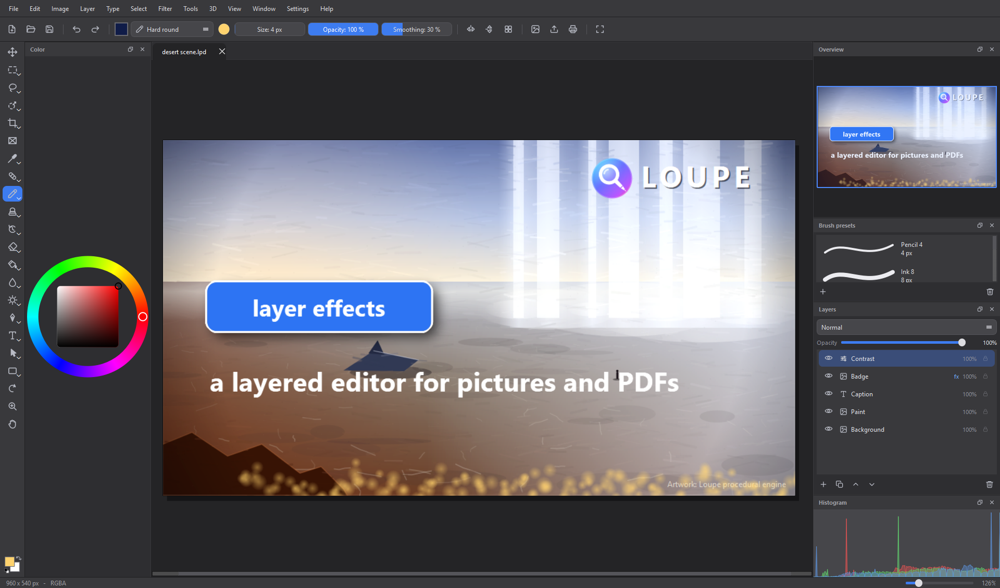
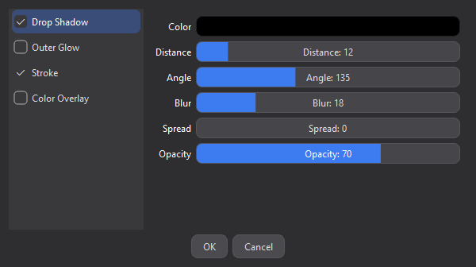
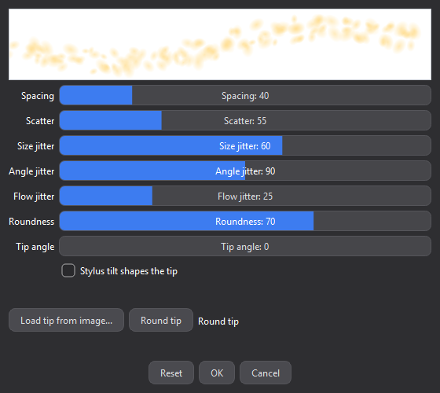
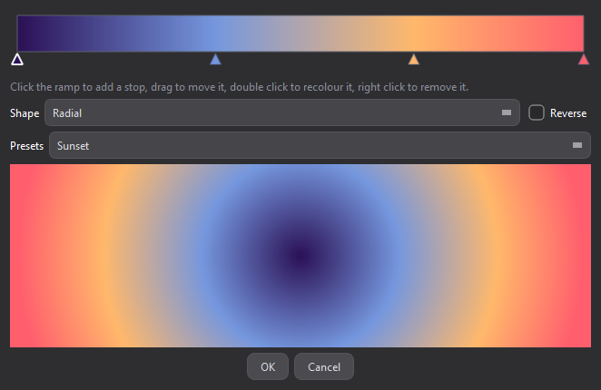
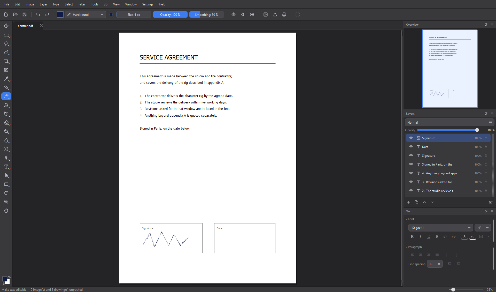
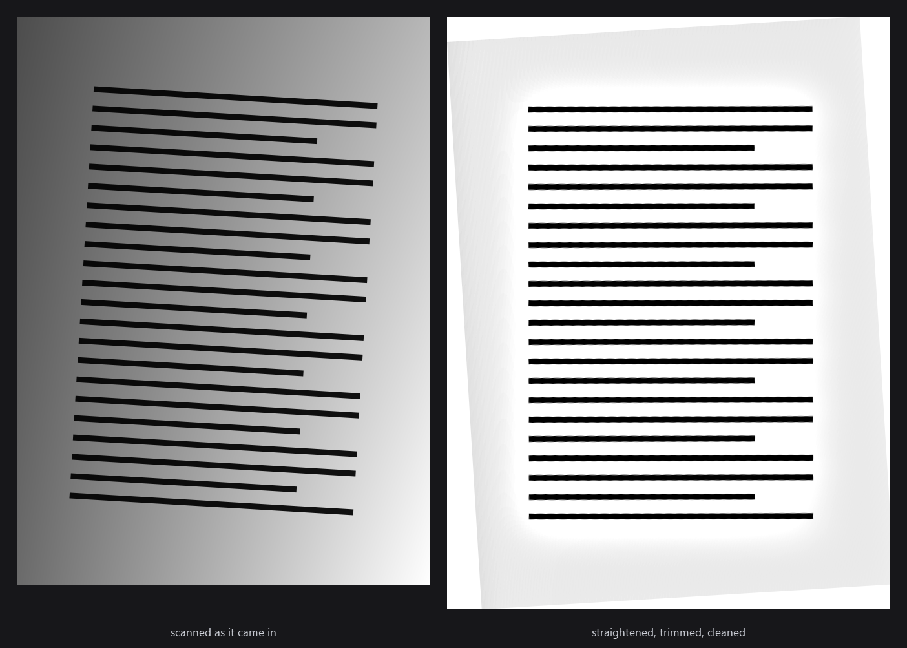
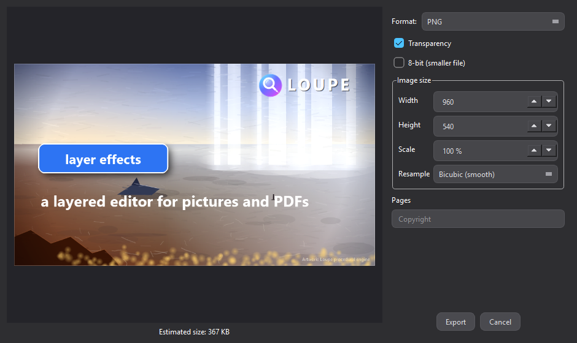

# Loupe

**A layered image and PDF editor for Windows.**

Paint, retouch, lay out, sign and export. Open a PDF and edit its text where it sits.
No subscription, no account, no cloud.

---

## What it is

Loupe is a single Windows application for the work that usually needs three: an image editor,
a PDF tool, and a scanner utility.

It is built around a real layer stack. Every picture, every line of text, every shape and every
adjustment stays on its own layer, in folders, with masks, blend modes and non destructive effects,
until you decide to flatten or export. Undo goes all the way back, including the free transform, the
filters, the fills and the layer effects, each as a single step.

It opens `.lpd` projects, PDFs, Photoshop files and every common picture format, and exports to nine
formats with real per format options. It is quick on big documents: a blur on a twelve megapixel
page takes about a second, and a session that opens and closes forty documents ends where it
started, with no memory left behind.

## Install

| | |
|---|---|
| **Installer** | [Download the latest LoupeSetup](../../releases/latest). Installs Loupe, associates `.lpd` project files, adds a Start menu entry, and registers a clean uninstaller in Windows Settings. The installer speaks 22 languages. |
| **Portable** | Take `Loupe-<version>-win64.zip` from the same page, unzip it anywhere, run `Loupe.exe`. |

Windows may show a SmartScreen warning on first run, because the build is not signed with a paid
certificate. Choose **More info**, then **Run anyway**.

Loupe checks for new versions from **Help > Check for updates**, verifies the download against its
published SHA-256, and installs it for you.

---

## Layers, masks, adjustments and effects

The layer panel is the centre of the application: pixel layers, text layers, vector shapes, folders,
adjustment layers and layer masks, with drag and drop reordering, colour tags, clipping masks,
opacity, blend modes, lock and isolate.

**Adjustment layers** change what is under them without touching it: brightness and contrast, gamma,
hue and saturation, black and white, invert, posterize, blur. Move one, hide it, delete it, and the
pixels below come back untouched.

**Layer effects** are live and non destructive, and they follow the layer while you paint on it:

- **Drop shadow**, with distance, angle, blur, spread and colour
- **Outer glow**, with blur and spread
- **Stroke**, placed outside, centred or inside
- **Colour overlay**

The dialog previews on the canvas as you drag a slider, cancelling puts the layer back exactly as it
was, and accepting is a single undo step. Effects are saved inside the project.

---

## Painting

Over 60 tools, grouped under Photoshop's own shortcut letters, with the sub tools on a flyout and
cycling on the same key: brush, pencil, ink pen, colour replacement, wet mixer, clone stamp, pattern
stamp, history brush, art history, eraser, fill, gradient, blur, sharpen, smudge, dodge, burn,
sponge, healing brush, patch, content aware move, red eye.

Graphics tablets are supported: pressure drives size and opacity, and tilt can shape the tip.

**Brush dynamics** cover spacing, scatter, size jitter, angle jitter, flow jitter, roundness and tip
angle, and any picture can become a brush tip: Loupe reads the tip from the picture's transparency,
or from how dark it is when it has none. Brush presets keep all of it, and the preview above the
sliders is a real stroke drawn with the current settings.

**Right click** anywhere on the canvas opens a round quick menu with the brush size, the flow, the
two colours, the tool variants, and a bezel to rotate the view.

**Clean ink** is a brush for people who sign documents with a mouse. It keeps the weight and the body
of your stroke and only cleans the path: hesitations are smoothed away, real corners are kept.

---

## Gradients

As many colour stops as you want. Click the ramp to add one, drag to move it, double click to
recolour it, right click to remove it. Five shapes (linear, radial, angle, reflected, diamond), a
reverse switch, transparency in any stop, and four ready made ramps.

---

## PDF, and PDF text you can actually edit

Open a PDF and it reads as a document. Ask for **Make text editable** and Loupe unpacks the page:
every line of text becomes a text layer at its exact position, in its own font at its own size,
every embedded image becomes a movable pixel layer, and every vector drawing becomes a real shape
layer that is still a vector.

From there you correct a wrong figure, move a block, sign in the box, and export back to PDF.

Text has a word processor style panel: font, size, bold, italic, underline, strike, superscript and
subscript, colour, highlight, alignment, lists, indents and line spacing. Double click any text on
the canvas to edit it in place.

---

## Scanned documents

Three commands under **Image > Scanned document** turn a phone photo of a page into something you
can send:

- **Straighten** measures how crooked the page is from the sharpness of its own text lines, and
  turns it back level.
- **Trim to content** crops the empty margin away.
- **Clean up paper** divides the page by its own lighting, so uneven light flattens out, the paper
  goes white, and the ink stays dark.

**Export searchable PDF** runs text recognition over the page and writes a PDF whose scanned text can
be searched and selected. It uses [Tesseract](https://github.com/UB-Mannheim/tesseract/wiki), a free
separate install, and says so when it is missing.

---

## Export

Nine formats, each with the options that matter for it: PNG (transparency, 8 bit), JPEG and WEBP
(quality), TIFF, BMP, GIF (colour count, dithering, animation from the pages), ICO (every Windows
size), PDF (all pages, annotated), SVG. Live preview, resize with a choice of resampling, page
selection, copyright metadata, and an estimated file size before you commit.

Also: print with a page setup, export every layer as its own file, export slices, and combine several
images into one PDF.

---

## Selections and transforms

Rectangle, ellipse, single row, single column, freehand lasso, polygonal lasso, magnetic lasso, quick
select, object select and magic wand, each with add, subtract and intersect, plus feathering, grow
and shrink, invert, select opaque, and marching ants that stay visible on a white page.

`Ctrl+T` is the Photoshop free transform: drag to move, handles to scale, outside the corners to
rotate, `Shift` to constrain, `Enter` to apply, `Esc` to cancel, and the whole thing is one undo
step.

Smart guides measure the distance between what you drag and everything else on the page, and snap to
the content rather than to the empty canvas around it.

---

## The interface

- **Documents in tabs**, each with its own history, and layers can be dragged from one to another
- **Dockable panels**: layers, history, pages, colour wheel, brush presets, text, info, histogram,
  swatches, notes, measurements, channels and properties, nested or floating, with saved workspaces
- **Rulers, grid, guides, snapping and layer edges**, all switchable
- **Overview thumbnail** for navigating a zoomed document
- **Autosave and session recovery**, with a prompt to restore what was open
- **Houdini style value sliders**: drag to scrub, middle click for a precision ladder, double click
  to type a number

### Languages and themes

English, French, Spanish, German, Italian, Portuguese, Japanese and Chinese, chosen from
**Settings > Language** and remembered between sessions. Four themes: dark, black, grey and light.

---

## Shortcuts

| | |
|---|---|
| `Ctrl+N` / `Ctrl+O` / `Ctrl+S` | New, open, save |
| `Ctrl+E` | Export as |
| `Ctrl+Z` / `Ctrl+Shift+Z` | Undo, redo |
| `Ctrl+T` | Free transform |
| `Ctrl+Shift+F` | Layer effects |
| `F5` / `Shift+F5` | Brush settings, gradient editor |
| `V M L W C I J B S Y E G O P T A U R Z H` | Tools, pressed again to cycle the variants |
| `X` / `D` | Swap the two colours, reset them |
| `[` / `]` | Brush size |
| Middle mouse, or `Ctrl` and middle | Pan, from any tool |
| Right click | Quick round menu |

---

## File formats

| | |
|---|---|
| **Open** | `.lpd` and `.loupe` projects, `.pdf`, `.psd` and `.psb`, `.png`, `.jpg`, `.bmp`, `.webp`, `.gif`, `.tif` |
| **Save** | `.lpd` project, keeping layers, folders, masks, text, vector shapes, adjustments and effects |
| **Export** | PNG, JPEG, WEBP, TIFF, BMP, GIF, ICO, PDF, SVG |

Photoshop files are read layer by layer and rebuilt as a Loupe stack, keeping the layer names,
positions and visibility.

---

## Under the hood

Written from scratch in Python with PySide6 (Qt 6), NumPy for the pixel work, PyMuPDF for PDF, and
Pillow and psd-tools for the formats Qt does not read natively. Packaged with PyInstaller and
Inno Setup.

Every release is checked against a battery of automated tests that drive the real application: the
tool set, the panels, the view, the notes, the ink cleaner, the layer panel, the history (every
operation is undone and redone, and the picture is compared pixel by pixel at each step), project
round trips, the layer effects, the brush engine, the gradients, the scan tools, and a hostile pass
that closes documents in the middle of a gesture, opens files that lie about their format, and
hammers the panels while documents come and go. Speed and memory are measured on every release: no
operation over its budget, and nothing left behind after forty documents.

---

**Loupe** &nbsp;&middot;&nbsp; (c) Gregoire Dehame

